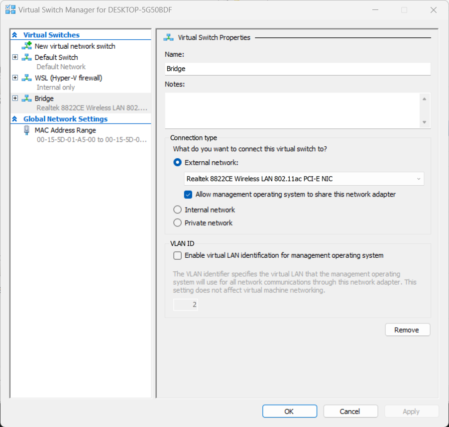

# Microk8s test cluster

This repo contains Helm charts and other resources for setting up a Kubernetes cluster with some example services.

## VM setup (Windows Hyper-V)

### Networking

We recommend setting up a Ubuntu VM with bridge networking, such that the VM can be accessed from the local network as if it were an ordinary machine.  In Windows, we can use the Hyper-V Manager for this.

> [!NOTE]
> For Linux, we can use Multipass with [bridge networking](https://multipass.run/docs/create-an-instance#bridging) (not tested). Note that for certain systems the bridge network needs to be created manually (e.g. using `netplan` for Ubuntu Server).

First, create a new virtual switch with an `External network` type:



In the Control Panel, ensure that the new network bridge only uses the network adapter you want to bridge. Also ensure that the `Network Bridge` connection (and **no other** connections) use the `Hyper-V Extensible Virtual Switch`.


### VM creation

Use the Quick Create wizard in Hyper-V Manager to create a new Ubuntu virtual machine (you will need to download an .iso file):


Use `More options` and ensure that the newly created bridge network is selected.  Start the new VM and follow the Ubuntu installation instructions.

### Router setup

Depending on your LAN router, you may wish to set up a fixed IP address for your virtual machine.  This may also automatically set up an DNS entry for your VM.

### SSH server

To enable connecting to the VM using ssh:
```bash
sudo apt install openssh-server
sudo systemctl start ssh
```

## Microk8s setup

See <https://microk8s.io/docs/getting-started> for installing `microk8s`.

After installling `microk8s`, enable the following [addons](https://microk8s.io/docs/addons):

```bash
microk8s enable dns
microk8s enable helm
microk8s enable hostpath-storage
microk8s enable dashboard
microk8s enable metrics-server
microk8s enable registry
```

> [!NOTE]
> After enabling the dashboard add-on, you can use `microk8s dashboard-proxy` to access the dashboard.

Next, create scripts for `kubectl` and `helm`:
```bash
sudo cat <<'EOF' > /usr/local/bin/kubectl
#!/usr/bin/env bash
microk8s kubectl $@
EOF
sudo chmod +x /usr/local/bin/kubectl

sudo cat <<'EOF' > /usr/local/bin/helm
#!/usr/bin/env bash
microk8s helm $@
EOF
sudo chmod +x /usr/local/bin/helm
```

See also: <https://www.linuxlinks.com/100-awesome-must-have-tui-linux-apps/>

## VS Code

We can develop in VS Code using our VM via SSH, following the instructions [here](https://marketplace.visualstudio.com/items?itemName=ms-vscode-remote.remote-ssh).

For Git integration:
```bash
git config --global user.name "Your Name"
git config --global user.email "your.email@example.com"
git config --global alias.root 'rev-parse --show-toplevel'
```
Also, install the GitHub command-line interface following the instructions [here](https://github.com/cli/cli/blob/trunk/docs/install_linux.md) for Linux, then log in using `gh auth login`.

## Docker Engine

To build containers for the Kubernetes cluster, install Docker Engine using the official [instructions](https://docs.docker.com/engine/install/ubuntu/). As we have enabled the `registry` addon in Microk8s, we can build and push our images to `localhost:32000` as follows:

```bash
docker buildx build . -t localhost:32000/my-image:latest --push
```

## Additional packages (optional)

Insert the following in `.bashrc`, before the `# Alias definitions.` line:

```bash
# Append to PATH variable
export PATH="$HOME/bin:$HOME/go/bin:$HOME/.cargo/bin:$PATH"
```

The following packages are recommended:

```bash
sudo snap install btop # Terminal-based system monitor
sudo snap install mycli # MySQL and MariaDB interface
sudo snap install yq # Color formatting for YAML files

sudo apt install ranger # Terminal-based file browser
sudo apt install screenfetch # System information
sudo apt install python-is-python3 # Python alias
sudo apt install build-essential pkg-config libssl-dev # Development tools

curl -LsSf https://astral.sh/uv/install.sh | sh # Python project manager

sudo snap install go --classic
go install github.com/kubecolor/kubecolor@latest # Adds color to kubectl
go install github.com/derailed/k9s@latest # Kubernetes CLI
go install github.com/charmbracelet/glow@latest # Markdown rendering in the terminal
```

### Pureline
Follow the instructions at https://github.com/chris-marsh/pureline to install and customise `pureline`, which provides an improved command-line prompt.

## `.bashrc` and `.bash_aliases`
Example `.bashrc` and `.bash_aliases` scripts are included in this repo as `example.bashrc` and `example.bash_aliases`, respectively.  These will set up useful alias and bash functions as well as enable auto-completions for `k(ubecolor)` and `helm`.  Note that the scripts assume all optional packages mentioned above have been installed.
