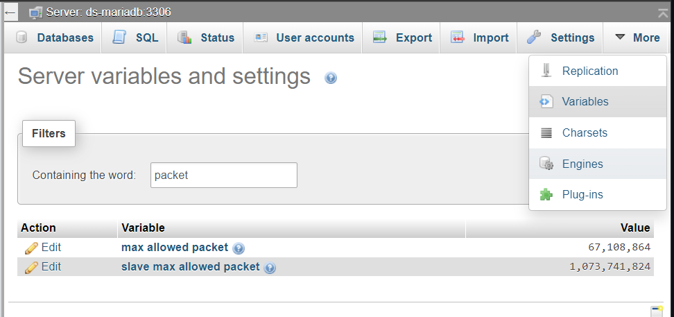

# MariaDB Helm chart and install scripts

This directory contains a Helm chart and install scripts for MariaDB and the phpMyAdmin web interface.

## Setup

0. Install the scripts in the `k8s-utils` directory if you haven't already (use `. install.sh`).

1. Copy `secret.example.env` to `secret.env` and edit the file to change the root account password.  Then, invoke the following to create the `ds-mariadb` Kubernetes secret:
  ```bash
  env2secret ds-mariadb secret.env > templates/secret.yaml
  ```

2. Install the chart dependecies using `helm dependency update`.

3. Edit `values.yaml` to set the host mount size and path, and uncomment the `volumePermissions` block (this is necessary only when creating the persistent volume for the first time and can be commented out again later).

4. Install the chart using `. install.sh`.

> [!NOTE]
> The contents of `secret.env` is used only to initialise the database server for the first time (i.e. the host mount is still empty). Change passwords using the phpMyAdmin interface instead.

## Access

Assuming Traefik is already installed (see instructions), phpMyAdmin should be available at `http://[hostname]:30000/phpmyadmin/`.  You can log in as `root` using the password set in `secret.env`.

## Backups

First, `port-forward` the MariaDB service on the Kubernetes cluster. Then, on the client machine:

```bash
sudo apt install mariadb-client
mariadb-dump -h $MARIADB_HOST -u root -p --all-databases > filename.sql
```

Change `$MARIADB_HOST` and `filename` above as desired.  Enter the root password (from `secret.env`) when prompted.

### Restoring backups (not tested)

See the [MariaDB documentation](https://mariadb.com/kb/en/restoring-data-from-dump-files/).

## Large files

> [!WARNING]
> To enable larger files (e.g. `BLOB` or `JSON` columns), the `max_allowed_packet` variable needs to be increased. This can be done in phpMyAdmin as shown below. Note however that sending too large a file can still cause the query to fail, or even crash the database!


