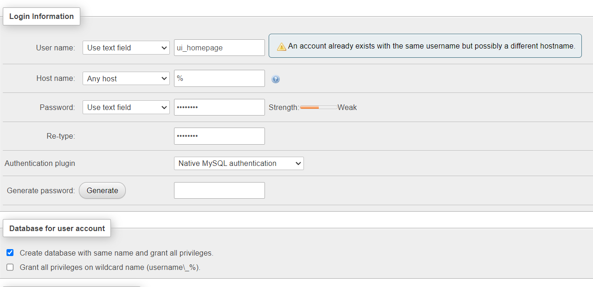

# Homepage

This directory contains a Helm chart for setting up the cluster homepage, a portal from which the other public services of the cluster can be accessed.

## Setup

First, install the `traefik` and `ds-mariadb` services, following the instructions in the respective `README.md` files.  This should give you a phpMyAdmin portal at `http://[hostname]:30000/phpmyadmin/`.

### Account and database creation

Log in as `root` and select the `User accounts` tab.



Create the `ui_homepage` account and database as shown above.  Next, copy `secret.example.env` to `secret.env` and edit the database connection string to contain the password for the account you just created.

> [!WARNING]
> Do not change the rest of the database connection string unless you are sure of what you are doing.

### Kubernetes secret

Source `create-secret.sh` to create a Kubernetes secret containing the contents of your `secrets.env` file.

### Chart installation

From the directory root (i.e. containing this `README.md` file):

```bash
helm install ui-homepage . -f values.yaml
```
